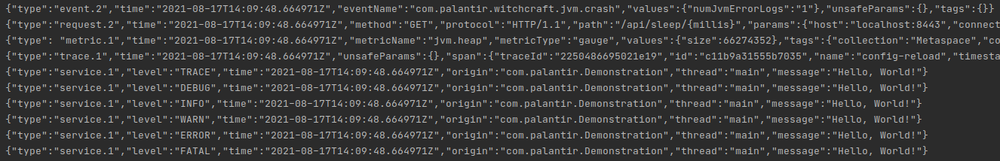
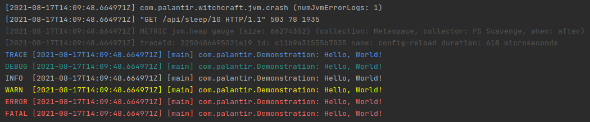
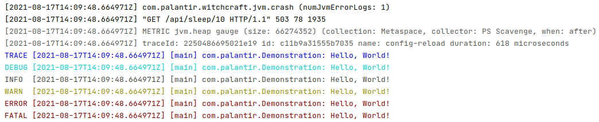

# Witchcraft Java Logging

Logging infrastructure for the Java language implementation of [witchcraft-api](https://github.com/palantir/witchcraft-api) logging functionality.

## Intellij Plugin

This repository provides an intellij plugin to parse and render witchcraft-api structured logs from IDE console output.

### Before the Intellij Plugin

### Using the Intellij Plugin

_Dark Mode_

_Light Mode_

## Formatting Library

The `witchcraft-logging-formatting` library is used by the Intellij Plugin to parse and format structured logging, and meant
to be reused anywhere that needs to format structured output.

## Gradle Plugin

The `com.palantir.witchcraft-logging` gradle plugin applies all standard witchcraft-logging functionality, however the following plugins may be applied individually if needed:

* `com.palantir.witchcraft-logging-idea` Updates Intellij configurations so developers are prompted to install the [Intellij Plugin](#intellij-plugin).
* `com.palantir.witchcraft-logging-testreport` Filters and formats unit test report stdout and stderr for human-readable logging.test
